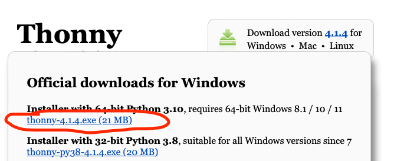
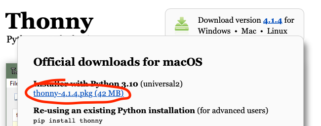
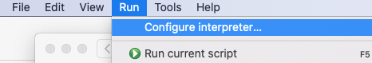
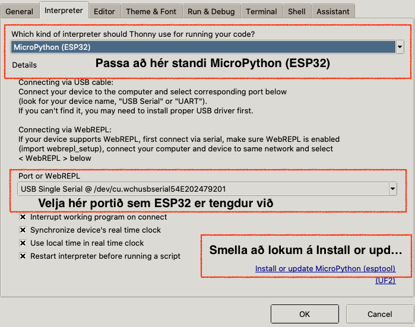
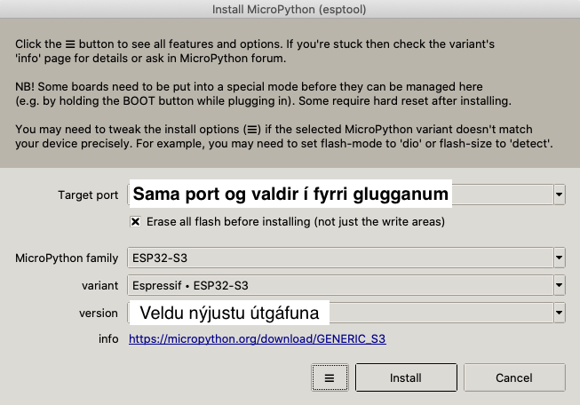
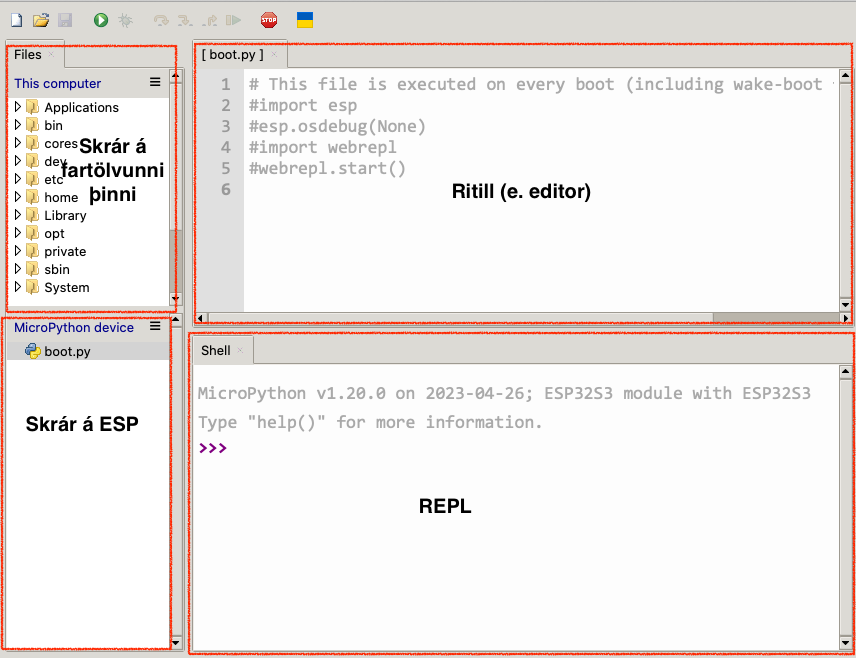

# Uppsetning á umhverfi fyrir ESP32

1. Sæktu og settu upp hjá þér CH343 rekilinn (e. driver) fyrir ESP32 á tölvuna þína:
   - Windows, velja CH343SER.EXE, þú finnur hann [hér](https://www.wch-ic.com/downloads/CH343SER_EXE.html).
   - MacOS, velja CH34XSER_MAC.ZIP, þú finnur hann [hér](https://www.wch-ic.com/downloads/CH34XSER_MAC_ZIP.html).
      - Eftir að skráin er ræst þarf að fara í *System Settings -> Privacy & Security*, skruna (e. scroll) neðst og smella á Allow takkan. 
   - Linux, [hér](https://www.wch-ic.com/downloads/CH341SER_LINUX_ZIP.html) ef þarf.
    
   :exclamation: Endurræstu svo tölvuna þína. :exclamation:
1. Sæktu og settu upp hjá þér nýjustu útgáfuna af Thonny, sjá [hér](https://thonny.org).
   - Windows:
     
     
   - MacOS (eða `brew install --cask thonny`):
     
     
   - Linux, nota uppáhalds "Package Manager"-inn sinn.
1. Settu ESP32-S3 stýritölvuna í samband við tölvuna þína með USB.
1. Ræstu upp Thonny.
   1. Í Thonny veldu *Run* og svo *Configure interpreter...*
   
        
   1. Veldu svo *Interpreter* flipann og veldu þar eftirfarandi (**ATH.** portið ætti að heita **USB Single Serial ...**):

        
   1. Gerðu eftirfarandi stillingar í glugganum sem birtist og smelltu svo á *Install* takkann. :warning: Passaðu að velja alltaf nýjustu útgáfuna (e. version).

        
   1. Uppsetningin getur tekið örfáar mínútur. En þegar stendur *Done* er óhætt að smella á *Close* takkann á glugganum. Og síðan á *OK* á næsta glugga.

        
1. Ef allt hefur gengið eins og í sögu þá ætti Thonny að líta svona út hjá þér (ef þú sérð ekki gluggana vinstra megin þarftu að fara í View og velja þar Files):
   
    
1. Ef þú fékkst upp villur þegar þú reyndir að setja micropython inn á ESP þá skaltu gera eftirfarandi, hafðu kveikt á Thonny:
   1. Sæktu [þessa](https://github.com/Freenove/Freenove_Ultimate_Starter_Kit_for_ESP32_S3/archive/refs/heads/main.zip) .zip skrá og **afþjappaðu** hana ( :exclamation: það er ekki nóg að tvísmella á hana, það þarf að hægrismella og velja *Extract all* eða annað álíka).
   2. Sæktu svo [þessa](https://micropython.org/resources/firmware/ESP32_GENERIC_S3-20231227-v1.22.0.bin) .bin skrá og settu hana í `Freenove_Ultimate_Starter_Kit_for_ESP32_S3/Python/Python_Firmware/` möppuna.
   3. Opnaðu skipanalínuna (*powershell* í windows, *terminal* í MacOS og Linux) á fartölvunni þinni og færðu þig í möppuna sem þú afþjappaðir skrána í lið 1.
     1. Ef skráin er í *Downloads* möppunni má gera eftirfarandi í skipanalínunni til að færa sig þangað: 
         - Windows: `cd ~\Downloads`
         - MacOS/Linux: `cd ~/Downloads`
     2. Færðu þig svo í skipanalínunni í möppuna `Freenove_Ultimate_Starter_Kit_for_ESP32_S3/Python/Python_Firmware/`.
     3. Opnaðu `ÞITT_STYRIKERFI.py` skrána og breyttu línu 7 þannig að hún líti svona út:
     ```python
     os.system("python esptool/esptool.py --chip esp32s3 --baud 2000000 write_flash -z 0 ESP32_GENERIC_S3-20231227-v1.22.0.bin")
     ```
     4. Lokaðu ritlinum (e. editor) sem þú notaðir til að breyta línunni og vertu áfram í skipanalínunni úr lið 2.
     5. Keyrðu svo þaðan eftirfarandi skipunina `python3 ÞITT_STYRIKERFI.py`
        - Ef þú færð villumeldingu frá Windows um að Python finnist ekki, notaðu þá Microsoft Store til að setja Python upp aftur.
     6. Hinkraðu meðan að keyrslan klárast og smelltu svo á rauða STOP takkann í Thonny og sjáðu hvort þetta er ekki bara komið inn.
## Halló heimur (blikk) í MicroPython

Smelltu á hamborgara táknið sem er við *MycroPython device* og veldu *New file...*. Gefðu skránni nafnið `main.py` (skráin verður að heita main.py). Settu svo eftirfarandi kóða í main.py:
```python
# Notum Pin úr machine kóðasafninu til að skilgreina pinnana á ESP. 
from machine import Pin
# Notum svo sleep_ms til að láta forritið bíða
from time import sleep_ms

# Búum til breytuna led og tengjum hana við pinna 2 á ESP. Segjum að pinninn sé úttakspinni
# Pinni 2 er tengdur við led peru sem er innbyggð í ESP
led = Pin(2, Pin.OUT)

# Gerum lykkju sem keyrir að eilífu
while True:
    # Skrifum 3.3V út á pinna 2
    led.value(1)
    # Bíðum í 500 millisekúndur
    sleep_ms(500)
    # Skrifum 0V út á pinna 2
    led.value(0)
    # Bíðum aftur í 500 millisekúndur
    sleep_ms(500)
```
Smelltu svo á græna "play" takkann til að keyra forritið.

Ef ekkert óvænt hefur gerst ættir þú að sjá led peru á ESP blikka.

Til að stöðva forritið skaltu smella með músinni í Shell/REPL svæðið í Thonny og ýta svo á <kbd>Ctrl</kbd> + <kbd>C</kbd>.
