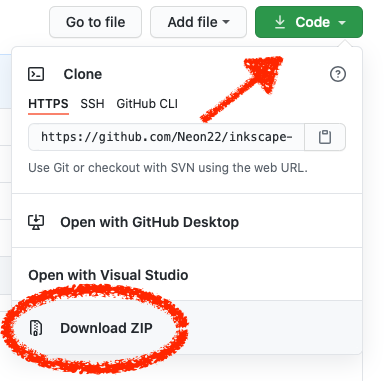
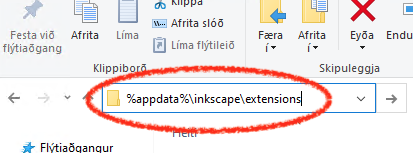

# TabbedBoxMaker (viðbót)

---

## Uppsetning

Til að búa til kassan utan um Arduino tölvuna tlum við að nota viðbót við Inkscape forritið.

Viðbótin heitir *TabbedBoxMaker* sem sækja má [hér](https://github.com/paulh-rnd/TabbedBoxMaker). Smelltu á Code og svo Download ZIP.



Næst þarf að afþjappa zip skránni og taka skrárnar með ```.py``` (python skrá) og ```.inx``` endingunum og setja þær í ```extensions``` möppuna fyrir Inkscape:
<!--
_ath. það virðist ekki virka að extract beint í extensions möppu_
-->

**Fyrir Windows:**

```bash
%AppData%\Inkscape\extensions
```

Einfaldast að afrita slóðina hér fyrir ofan og líma hana í Explorer gluggann í Windows:



<!-- 1. Windows: Setja skrár td. í `C:\Program Files\Inkscape\share\inkscape\extensions` eða þar sem Inkscape er vistað. -->

**Fyrir MacOS**

Keyra skipunina hér fyrir neðan í Terminal til að opna ```extensions``` möppuna í Finder:

```bash
open /Applications/Inkscape.app/Contents/Resources/share/inkscape/extensions
```


**Fyrir Linux**

Mismunandi en algeng staðsetning:

```bash
~/.config/inkscape/extensions
```


Til að sjá hvar ```extensions``` mappan er má alltaf fara í *Preferences -> System* í Inkscape. Þar er listi yfir allar möppur sem Inkscape notar. <br>
Þegar viðbótin hefur verið sett í rétta möppu þarf að endurræsa Inkscape. <br>
Viðbótina má svo finna í *Extensions -> CNC Tools* 


---

## Notkun á Tabbed Box Maker

Með TabbedBoxMaker tilgreinir þú hversu stóra tab þú vilt hafa.

Stillingar sem á að nota:
* Box dimensions: inside (nota innanmál í mælingum)
* Maximum/Preferred Tab Width 15
* Material Thickness: 3.10
* Kerf: 0.2


