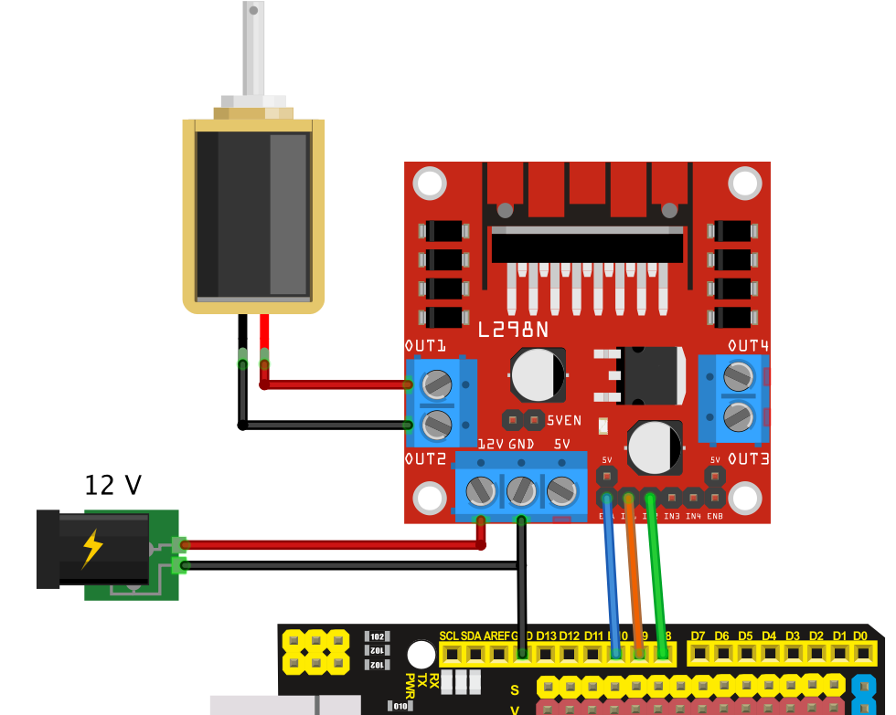

# Efni fyrir forritun Arduino í lokaverkefni

## TDelay

Vandamálið við innbyggða `delay()` fallið í Arduino er að það blokkerar (e. block) forritið sem er að keyra á Arduino-num. Það þýðir að forritið stoppar og gerir ekkert annað en að bíða eftir að tíminn sem skilgreindur er í `delay()` fallinu er liðinn. Þetta skapar vandamál ef að Arduino-inn á að vera gera eitthvað annað á meðan beðið er.

TDelay leysir þetta en þó með aðeins annarri virkni. Þannig að í stað þess að bíða eftir að tíminn er liðinn þá þarf að spyrja TDelay hvort biðtíminn sé liðinn.

Notkun:

1. Búa til breytu af taginu TDelay (t.d.): `TDelay led_delay(1000);` breytan `led_delay` er þá með innbyggðan teljari sem kláras á 1000 ms.
2. Spyrja breytuna hvort tíminn er liðinn með fallinu `timiLidinn()` sem skilar `true` ef tíminn er liðinn annars `false` (t.d.): `if(led_delay.timiLidinn() == true) { /* gera það sem á að gera þegar biðtíminn er liðinn */ }`.
3. Ef þarf þá má breyta biðtímanum með fallinu `setBidtimi(nýr biðtími)` (t.d.): `led_delay.setBidtimi(1500)`, biðtíminn er núna 1500 ms.

Sjá nánar um notkun í dæmunum hér fyrir neðan.

<!-- 
Dæmi:

| Delay | TDelay |
| --- | --- |
| <pre>delay(1000); digitalWrite(LED, HIGH);</pre> | <pre>if(led_delay.timiLidinn() == true) { &emsp; digitalWrite(LED,HIGH) }</pre>
-->

Kóðasafnið fyrir TDelay má finna [hér (zip skrá)](https://github.com/VESM1VS/AFANGI/raw/main/Kodi/tdelay.zip). Sett inn á Arduino IDE með því að fara í *Sketch->Include Library->Add .ZIP Library...*

## Blikkandi LED

- [Ein LED pera, blikkar á einnar sekúndu fresti.](https://wokwi.com/projects/349788528390963795)
- [Ein LED pera, mismunandi á og af tími](https://wokwi.com/projects/349253817043255891)
- [Þrjár LED perur, slembi (e. random) blikktími](https://wokwi.com/projects/349252429929251411)

## Servo mótor

- [Einn Servo mótor - (0°-90°-180°-90°-0°)](https://wokwi.com/projects/349789993741320787)
- [Einn Servo mótor - 0° til 180° til 0° (sweep)](https://wokwi.com/projects/349792066153218642)
- [Tveir Servo mótorar - sweep á misjöfnum hraða](https://wokwi.com/projects/349794862688633427)
- [Servo, Sonic og LED, Servo og LED stjórnast með Sonic](https://wokwi.com/projects/349337061426201170)

## MP3 spilari

- [Kóðadæmi](../Kodi/DFPlayer_Demo2.ino)

## DC mótor

Tengimynd og [kóði](../Kodi/einn_dc_l298n.ino):

