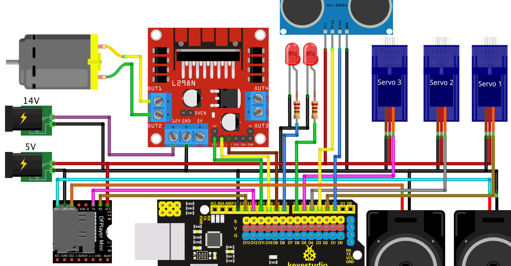

## Að forrita animatronics senu 

---

### MP3 spilari
 
[Tutorial](https://wiki.dfrobot.com/DFPlayer_Mini_SKU_DFR0299) til að geta spila MP3 hljóðskrá með MP3 spilara og hátalara.
- [kóðasýnidæmi með TDelay](../Kodi/DFPlayer_TDelay.ino)
- _kóðasýnidæmi; [delay](../Kodi/DFPlayer_Demo2.ino) og [millis](../Kodi/DFPlayer_Demo1.ino)_
- [DFRobotDFPlayerMini safn](https://github.com/DFRobot/DFRobotDFPlayerMini/archive/1.0.3.zip), líka hægt að sækja með _Library Manager_.

<!-- :warning: Muna að aftengja RX pinna á MP3 spilara meðan kóða er hlaðið upp (e. upload) á Arduino.  -->

---

### Ultrasonic fjarlægðarmælir

Til að ákveða hvenær hreyfingarnar eiga að byrja má nota [HC-SR04 Ultrasonic](https://lastminuteengineers.com/arduino-sr04-ultrasonic-sensor-tutorial/) fjarlægðarskynjarann.

Sýnikóði er [hér](../Kodi/ultrasonic.ino).

---

### Sýnidæmi með TDelay 

- [Þrjár LED perur, slembi (e. random) blikktími](https://wokwi.com/projects/349252429929251411)
- [Einn Servo mótor - (0°-90°-180°-90°-0°)](https://wokwi.com/projects/349789993741320787)
- [Einn Servo mótor - 0° til 180° til 0° (sweep)](https://wokwi.com/projects/349792066153218642)
- [Tveir Servo mótorar - sweep á misjöfnum hraða](https://wokwi.com/projects/349794862688633427)
- [Servo (sweep) og DFPlayer](https://github.com/VESM1VS/AFANGI/blob/main/Kodi/TDelay_Servo_DFPlayer.ino)
- [Servo og LED stjórnast með fjarlægð úr Sonic](https://wokwi.com/projects/349337061426201170) 
- [Senur með DC mótor](https://github.com/VESM1VS/AFANGI/blob/main/Kodi/einn_dc_l298n.ino) 

---

### Samsett dæmi með öllum íhlutum

Hér er dæmi um hvernig má púsla öllum íhlutunum saman og [forrita](../Kodi/samsett_daemi.ino). Athugið að ef þið þurfið fleiri pinna, að ekki er ráðlegt að nota pinna `0` og `1` á Arduino en það er hægt að nota *Analog* pinnana `AX` þar sem X er 0 til og með 5. Þá er hægt að nota alveg eins og hina pinnana, dæmi: `const int LED3 = A0;` og svo í *setup* fallinu `pinMode(LED3, OUTPUT);`.

:warning:  DC og Servo vinna ekki samtímis á hvaða pinna sem er. Ekki nota pinna 9 og 10, notið aðra (t.d. 5 og 6) sem eru með ~tákn (e. tilda) fyrir framan pinna.  
> servo.h library messes up with the Arduino pwm pins. It disables the 9,10 pins even we haven't connected a servo to that. We have to use pwm other than (9,10) for the dc motor driver's enable pin.

