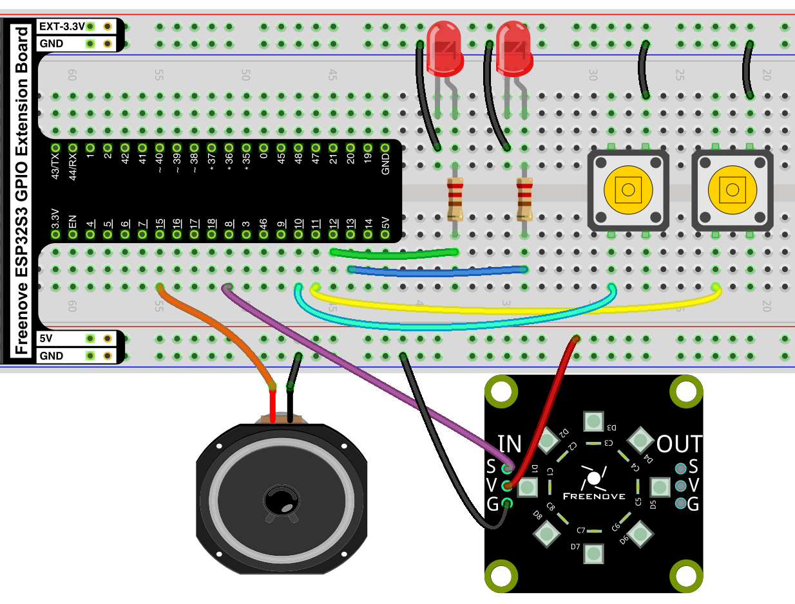

## Tímaverkefni 1 

- 10% af heildareinkunn áfanga.
- Einstaklingsverkefni.
- [ESP32 og Micropython](https://github.com/VESM1VS/AFANGI/wiki/Micropython).

---

### Settu eftirfarandi rás á brauðbretti



Þú notar svo þessa uppsetningu fyrir kóðaverkefnin hér að neðan.

---

### Verkefni 1 - Blikk 

Búðu til nýtt skjal í Thonny og nefndu það `V_1_1.py`. 

Hægri og vinstri peran eiga að blikka til skiptis, þegar hægri er kveikt á vinstri að vera slökkt og svo öfugt. Þær eiga að skipta um stöðu á 250 ms. fresti.


#### Verkefni 2 - Blikk með takka 

Búðu til nýtt skjal í Thonny og nefndu það `V_1_2.py`. 

Bættu við virkni þannig að perurnar (Verkefni 1) blikka bara á meðan takka A er haldið inni. Ef ekki er ýtt á takka A eiga báðar perurnar að vera slökktar.

Sýndu svo kennaranum virknina.

---

### Verkefni 3 - Rofar

Búðu til nýtt skjal í Thonny og nefndu það `V_1_3.py`. 

Skoðaðu [þessa](https://github.com/VESM1VS/AFANGI/blob/main/Kennsluefni/digital.md#rofar) grein um rofa og taktu eftirfarandi kóða og **aðlagaðu** hann að brauðbrettis uppsetningunni þinni. 

```python
from machine import Pin

takki = Pin(14, Pin.IN, Pin.PULL_UP)
led = Pin(2, Pin.OUT)

ljos_kveikt = False  

while True:
    takki_stada = takki.value() 
    if takki_stada == 0:    # athuga hvort ýtt var á takka (0 útaf PULL_UP)
        ljos_kveikt = not ljos_kveikt   # víxla gildinu á bool breytunni
    led.value(ljos_kveikt)  # skrifa út á ljósið
```

> [!NOTE]
> Takkinn mætti virka betur. Ástæðan fyrir því hversu illa hann virkar er svokallað snertuhopp sem hægt er að laga betur t.d. með kóða (debounce).

Skoðaðu núna [debounce](https://github.com/VESM1VS/AFANGI/blob/main/Kennsluefni/digital.md#debounce) og notaðu eftirfarandi kóða og **aðlagaðu** hann að brauðbrettis uppsetningunni þinni. Þá ætti takkinn að virka betur.

```python
from machine import Pin

takki = Pin(14, Pin.IN, Pin.PULL_UP)
led = Pin(2, Pin.OUT)

ljos_kveikt = False
takki_stada_adur = 1 # breytan geymir stöðuna á takkanum í síðustu umferð

while True:
    takki_stada = takki.value()
    # Bætum við að skoða líka stöðuna í síðustu umferð 
    if takki_stada_adur == 1 and takki_stada == 0:
        ljos_kveikt = not ljos_kveikt
    led.value(ljos_kveikt)
    takki_stada_adur = takki_stada # uppfærum stöðuna fyrir næstu umferð
```

Bættu núna við öðrum takka í kóðann þinn sem virkar sem rofi fyrir hina LED peruna (tvær LEDs).

Sýndu svo kennaranum virknina þar sem báðir takkarnir virka.

---

### Verkefni 4 - Rauður - Grænn - Blár
Búðu til nýtt skjal í Thonny og nefndu það `V_1_4.py`. 

Skoðaðu og eftirfarandi [kóðasýnidæmi](https://github.com/VESM1VS/AFANGI/blob/main/python/NeoPixel.py).

Allar NeoPixel perurnar eiga að lýsa rauðu ljósi í eina sekúndu, síðan eiga þær að allar að lýsa grænu ljósi í eina sekúndu að lokum eiga þær allar að lýsa bláu ljósi. Þetta á svo að endurtaka sig að eilífu. 

---

### Verkefni 5 - Hring eftir hring
Búðu til nýtt skjal í Thonny og nefndu það `V_1_5.py`. 

Ein NeoPixel pera á að lýsa í einu og á ljósið að "færast" réttsælis (e. clockwise) yfir á næstu peru, þegar ljósið hefur klárað hringinn á það að byrja á nýjum hring.

Sýndu svo kennaranum virknina.


---

### Verkefni 6 - Átta hliða teningur og hljóð

Búðu til nýtt skjal í Thonny og nefndu það `V_1_6.py`. 

Þegar ýtt er á takka A lýsir tilviljunarkennt (e. random) ljós á NeoPixel hringnum. Þegar ljósið birtist á að heyrast hljóð.

Þú gerir hljóð með því að nota [PWM](https://github.com/VESM1VS/AFANGI/blob/main/Kennsluefni/analog.md#unni%C3%B0-me%C3%B0-hli%C3%B0r%C3%A6n-gildi-%C3%AD-esp32). 

Dæmi:

```python
from machine import Pin, PWM
from time import sleep_ms

# skilgreina pinna og upphafstíðni
hatalari = PWM(Pin(15), 20000)

hatalari.duty(512) # Kveikir á hátalara
hatalari.freq(440) # Spila 'A' nótu
sleep_ms(250)      # í 250 ms.
hatalari.duty(0)  # slekkur á hátalara
```

Sýndu svo kennaranum virknina

---

### Verkefni 7 - Neopixel stjórnun með tökkum
Búðu til nýtt skjal í Thonny og nefndu það `V_1_7.py`. 

Notaðu A og B takkana til að láta eitt ljós ferðast um NeoPixel hringinn. A færir í aðra áttina og B færir í hina. Ekki gleyma að huga að [debounce](https://github.com/VESM2VT/ESP32/blob/main/kennsluefni/digital.md#debounce).

Sýndu svo kennaranum virknina

---

### Verkefni 8 - Andandi LED pera

Búðu til nýtt skjal í Thonny og nefndu það `V_1_8.py`. 

Rauð LED pera á að byrja slökkt en svo smátt og smátt á hún að auka birtumagnið. Þegar hún hefur náð fullum sljósstyrk á hún að minnka birtumagnið smám saman þar til að slokknar á henni. Þetta endurtekur hún að eilífu.

Byrjunarkóði:
```python
# Sækja auka forritasöfn. Þurfum Pin, PWM og sleep_ms

# Skilgreina pinnann sem rauða peran er tengd við sem PWM

# þurfum breytu sem heldur utan um birtumagnið á hverjum tíma og getur hækkað og lækkað
birtumagn = 0
# Breyta sem veit hvort ljósmagnið á að aukast eða minnka
birtir = True

while True:
   # skrifa birtumagnið á rauða LED

   # ef ljósmagnið á að aukast 
      # hækka þá birtumagns breytuna um 1
   # annars 
      # lækka birtumagns breytuna um 1

   # ef birtumagn er 0 eða birtumagn er 1023
      # snúa birtir breytunni við ef hún er True á hún að verða False og svo öfugt

   # bíða (sleep_ms) í örfáar (minna en 5) millisekúndur
```

---

## Námsmat og skil
- Skilið öllum kóðaskrám á Innu.
- Yfirferð og námsmat á sér stað í tímum úr ofangreindum liðum.
- Fyrir hvern lið sem er metin; Fullt fyrir fullnægjandi lausn, ekkert ef lausn er ábótavant eða vantar.
- Passið að skilja allan kóða sem þið skilið. 

<!--
> [!NOTE]
> Ef nemandi notar gervigreind við að leysa verkefnið er gefið 0 (núll) fyrir verkefnið í heild.
-->
