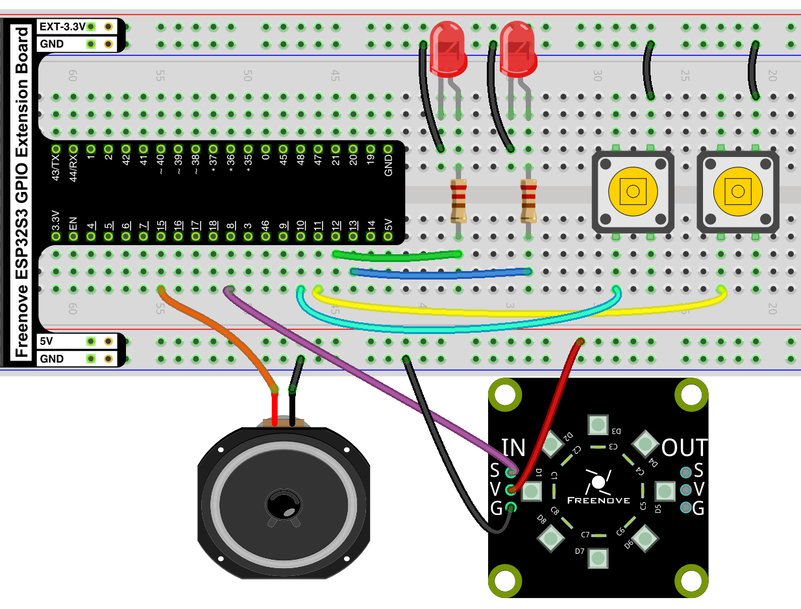

## Tímaverkefni 3 

- 10% af heildareinkunn áfanga.
- [ESP32 og Micropython](https://github.com/VESM1VS/AFANGI/wiki/Micropython).
- Einstaklingsverkefni.
- Passið að skilja allan kóða sem þið skilið. Ef nemandi notar gervigreind við að leysa verkefnið er gefið 0 (núll) fyrir verkefnið í heild.

### Verkefni 1 - Rás
Settu þessa rás á brauðbretti:



Lesefni: 
 - [Stafræn gildi](https://github.com/VESM2VT/ESP32/blob/main/kennsluefni/digital.md)
 - [Hliðræn gildi](https://github.com/VESM2VT/ESP32/blob/main/kennsluefni/analog.md)


Ítarefni:
 - [PWM](https://en.wikipedia.org/wiki/Pulse-width_modulation)
 - [Duty cycle](https://en.wikipedia.org/wiki/Pulse-width_modulation#Duty_cycle)

---

### Verkefni 2 

Búðu til nýtt skjal í Thonny og nefndu það `V_3_2.py`. Notaðu sömu uppsetningu á brauðbrettinu og þú notaðir í verkefninu hér að ofan.

#### Andandi LED pera

Rauða LED peran á að byrja slökkt en svo smátt og smátt á hún að auka birtumagnið. Þegar hún hefur náð fullum sljósstyrk á hún að minnka birtumagnið smám saman þar til að slokknar á henni. Þetta endurtekur hún að eilífu.

Byrjunarkóði:
```python
# Sækja auka forritasöfn. Þurfum Pin, PWM og sleep_ms

# Skilgreina pinnann sem rauða peran er tengd við sem PWM

# þurfum breytu sem heldur utan um birtumagnið á hverjum tíma og getur hækkað og lækkað
birtumagn = 0
# Breyta sem veit hvort ljósmagnið á að aukast eða minnka
birtir = True

while True:
   # skrifa birtumagnið á rauða LED

   # ef ljósmagnið á að aukast 
      # hækka þá birtumagns breytuna um 1
   # annars 
      # lækka birtumagns breytuna um 1

   # ef birtumagn er 0 eða birtumagn er 1023
      # snúa birtir breytunni við ef hún er True á hún að verða False og svo öfugt

   # bíða (sleep_ms) í örfáar (minna en 5) millisekúndur
```

Sýndu svo kennaranum virknina og skilaðu kóðaskjalinu á Innu.

>  [Uppsetning á umhverfi fyrir ESP32](https://github.com/VESM2VT/ESP32/blob/main/verkefni/Timaverkefni0.md) 

---

### Verkefni 3 

Búðu til nýtt skjal í Thonny og nefndu það `V_3_3.py`. Notaðu sömu uppsetningu á brauðbrettinu og þú notaðir í verkefninu hér að ofan.

#### Blikk (5%)

Hægri og vinstri peran eiga að blikka til skiptis, þegar hægri er kveikt á vinstri að vera slökkt og svo öfugt. Þær eiga að skipta um stöðu á 250 ms. fresti.

#### Blikk með takka (5%)

Bættu við liðinn hér að ofan virkni þannig að perurnar blikka bara á meðan takka A er haldið inni. Ef ekki er ýtt á takka A eiga báðar perurnar að vera slökktar.

Sýndu svo kennaranum virknina og skilaðu kóðaskjalinu á Innu.

---

### Verkefni 4 

Búðu til nýtt skjal í Thonny og nefndu það `V_3_4.py`. Notaðu sömu uppsetningu á brauðbrettinu og þú notaðir í verkefninu hér að ofan.

#### Rofar

Skoðaðu [þessa](https://github.com/VESM2VT/ESP32/blob/main/kennsluefni/digital.md#rofar) grein um rofa og taktu fyrri kóðann og **aðlagaðu** hann að brauðbrettis uppsetningunni þinni. Notaðu vinstri takkann og vinstri LED peruna.

Þegar þú hefur áttað þig á vandamálinu skaltu taka neðri kóðann í greininni og aðlaga hann að þinni brauðbrettis uppsetningu.

Að lokum átt þú að bæta við virknina þannig að hægri takkinnn virki sem rofi fyrir hægri LED peruna.

Sýndu svo kennaranum virknina og skilaðu kóðaskjalinu á Innu.

---

### Verkefni 5 

Búðu til nýtt skjal í Thonny og nefndu það `V_3_5.py`. Notaðu sömu uppsetningu á brauðbrettinu og þú notaðir í verkefninu hér að ofan.

#### Rauður - Grænn - Blár

Allar NeoPixel perurnar eiga að lýsa rauðu ljósi í eina sekúndu, síðan eiga þær að allar að lýsa grænu ljósi í eina sekúndu að lokum eiga þær allar að lýsa bláu ljósi. Þetta á svo að endurtaka sig að eilífu. 

Sýndu svo kennaranum virknina og skilaðu kóðaskjalinu á Innu.

> [Sýnidæmi](https://github.com/VESM1VS/AFANGI/blob/main/python/NeoPixel.py)

---

### Verkefni 6 

Búðu til nýtt skjal í Thonny og nefndu það `V_3_6.py`. Notaðu sömu uppsetningu á brauðbrettinu og þú notaðir í verkefninu hér að ofan.

#### Hring eftir hring

Ein NeoPixel pera á að lýsa í einu og á ljósið að "færast" réttsælis (e. clockwise) yfir á næstu peru, þegar ljósið hefur klárað hringinn á það að byrja á nýjum hring.

#### Fram og til baka

Í stað þess að byrja nýjan hring á ljósið að fara sömu leið til baka. Endurtekið að eilífu.

Sýndu svo kennaranum virknina og skilaðu kóðaskjalinu á Innu.

---

### Verkefni 7

Búðu til nýtt skjal í Thonny og nefndu það `V_3_7.py`. Notaðu sömu uppsetningu á brauðbrettinu og þú notaðir í verkefninu hér að ofan.

#### Takkar og ljós

Notaðu A og B takkana til að láta eitt ljós ferðast um NeoPixel hringinn. A færir í aðra áttina og B færir í hina. Ekki gleyma að huga að [debounce](https://github.com/VESM2VT/ESP32/blob/main/kennsluefni/digital.md#debounce).

Sýndu svo kennaranum virknina og skilaðu kóðaskjalinu á Innu.

---

### Verkefni 8 

Búðu til nýtt skjal í Thonny og nefndu það `V_3_8.py`. Notaðu sömu uppsetningu á brauðbrettinu og þú notaðir í verkefninu hér að ofan.

#### Átta hliða teningur

Þegar ýtt er á takka A lýsir tilviljunarkennt (e. random) ljós á NeoPixel hringnum. Þegar ljósið birtist á að heyrast hljóð.

Þú gerir hljóð með því að nota PWM. Dæmi:
```python
from machine import Pin, PWM
from time import sleep_ms

# skilgreina pinna og upphafstíðni
hatalari = PWM(Pin(15), 20000)

hatalari.duty(512) # Kveikir á hátalara
hatalari.freq(440) # Spila 'A' nótu
sleep_ms(250)      # í 250 ms.
hatalari.duty(0)  # slekkur á hátalara
```

Sýndu svo kennaranum virknina og skilaðu kóðaskjalinu á Innu.

---

#### Micropython forritun 
1. [Kóðasýnidæmi 1 - 5](https://github.com/VESM1VS/AFANGI/tree/main/python)

---

## Námsmat og skil
- Yfirferð og námsmat á sér stað í tímum úr ofangreindum liðum.
- Fyrir hvern lið; Fullt fyrir fullnægjandi lausn, ekkert ef lausn er ábótavant eða vantar.
